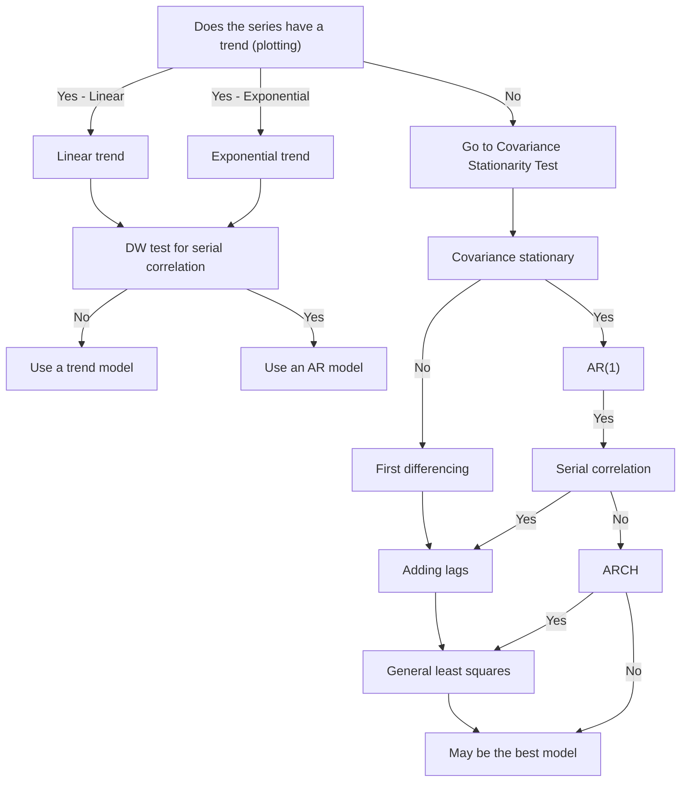

# Time-series 

## Linear Trend Model

Work with constant change amount:
$$
y_t = b_0 +b_1t+\epsilon
$$

## Log-Linear Model

Applying log transform to work with constant growth rate time series:
$$
y_t =e^{b_0+b_1t+\epsilon}
$$
The trend models are generally not appropriate for time series when data are serial correlated. We can use Durhin-Watson test to detect serial correlation. 

## Autoregressive Model (AR)

**Autoregressive model** use past values of dependent variables as independent variables. 
$$
AR(p):x_t =b_0+b_1x_{t-1}+\cdots+b_px_{t-p}+\epsilon
$$

* Additional assumption: **Covariance Stationary**:
  * Constant and finite expected value in all periods
  * Constant and finite variance in all periods
  * Constant and finite covariance with itself for a fixed number of periods among all periods.

### Detecting Serial Autocorrelation

* Fit the $AR(1)$ model
* Compute autocorrelations
* View **ACF** plot and decide.
* t test: $t = \frac{\hat{\rho_{\epsilon_t,\epsilon_{t-k}}}}{1/\sqrt{T}}$, $H_0:$ No autocorrelation.

## Moving Average Model (MA)

 **Moving Average** model use lagged residuals to model:
$$
x_t = \epsilon_t +\theta\epsilon_{t-1}
$$
For an $MA(q)$ model the first $q$ autocorrelations will be significantly different from $0$. All beyond that will be equal to $0$.

Comining will give **ARIMA** model.

## Violations of Assumptions

### Seasonality

**Seasonality** refers to time series show regular patterns of movement within the year. It is to include a seasonal lag in **AR** model.

### Unit Root

#### Mean Reversion

A time series shows **mean reversion**. if it tends to move to its mean.

For an $AR(1)$ model, its mean-reverting level is $x_t=\frac{b_0}{1-b_1}$, when $|b_1|<1$ and has covariance stationary.

> [!Note]
>
> When $b_1=1$, $AR(1)$ becomes random walk. If $b_0=0$ it is simple random walk, if not, it is random walk with drift.
>
> Random walt will not exhibit covariance stationary. In this case, least square method cannot be trusted to model $AR(1)$. In this case, we say the time series has a **unit root**.*But t-test cannot be used to test unit root*.

Therefore, **Dicky-Fuller** test will bne used to test unit root. We test $x_t-x_{t-1}=b_0+(b_1-1)x_{t-1}+\epsilon_t$. We test if $g_1=b_1-1=0$:

$H_0:g_1=0,H_1:g_1<0$. We calculate $t$ statistics and use revised critical value (larger than usual).

#### First Differencing

Applying first order differencing on random walk will result in $y_t=x_t-x_{t-1}=\epsilon_t$, which stabilize the time series.

### Heteroskedasticity

Recall: **Conditional heteroskedasticity** defines case where the heteroskedasticity of the error variance is correlated with the values of the independent variables.

When **Conditional heteroskedasticity** exists in **AR** model, we call it **ARCH**.

#### ARCH Model

In addition to $AR$, $ARCH$ also model the variance of residuals:
$$
\sigma_{\epsilon_t}^2=a_0+a_1\epsilon_{t-1}^2+\cdots+u_t
$$
$GARCH$ also include past variance of residuals to model (e.g $\sigma_{\epsilon_{t-1}^2}$)

> [!note]
>
> We should use Generalized Least Square to fit the model if conditional heteroskedasticity exists.

### Regression With More Than One Time Series

* Test unit root for both
* If both have unit root. If they have **cointegration** (long-term financial or economic  relationship so that they do not diverge from each other in the long run), we can use linear regression
* To test cointegration, we apply **Engle and Granger test** to test unit root on the residual term.We want to make sure error term has no unit root.

## Model Selection

