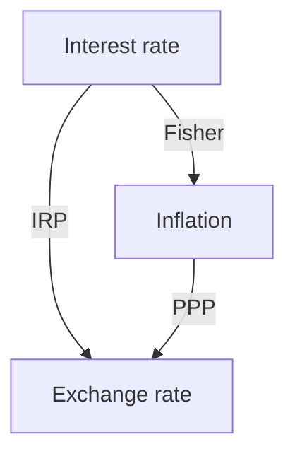

# Currency Exchange Rate

## Exchange Rate Calculation

### Basic FX notation

* Price Currency/Base Currency: 7 CNY/USD

* Spot Exchange Rate: Currency Exchange rate for immediate delivery

* Forward exchange rate: Contracted exchange rate for future deal.

* Bid/Offer price: The offer price is always higher than bid price. The price is given by **dealer**. The counter party is either **hit the bid**(sell) or paid the offer(buy.

* Bid-offer spread: Spread in FX is noted as 'pips' (base point), except for yen ($\frac{1}{100}$). The spread to client is wider than interbank market. The spread depends on:

  * The spread in interbank market
  * Size of transaction (larger, larger)
  * Relationship between the dealer and client

  and interbank spreads depend on:

  * Currency pair involved (Major pair less spread) $\to$ liquidity
  * Time of day
  * Market volatility

### Cross Rate

Basic cross rate:
$$
\frac{KRW}{CNY}=\frac{KRW}{USR}\times \frac{USD}{CNY}
$$

- $\left(\frac{A}{B}\right)_{\text{bid}} = \left(\frac{A}{C}\right)_{\text{bid}} \left(\frac{C}{B}\right)_{\text{bid}}$
- $\left(\frac{A}{B}\right)_{\text{ask}} = \left(\frac{A}{C}\right)_{\text{ask}} \left(\frac{C}{B}\right)_{\text{ask}}$
- $\left(\frac{A}{B}\right)_{\text{bid}} = \frac{1}{\left(\frac{B}{A}\right)_{\text{ask}}}$
- $\left(\frac{A}{B}\right)_{\text{ask}} = \frac{1}{\left(\frac{B}{A}\right)_{\text{bid}}}$

#### Example

$CHF/USD=1.5960-70$, $AUD/USD =1.7225-35$. Calculate $AUD/CHF$.

We first calculate the bid price:
$$
\frac{AUD}{CHF}_{bid}=\frac{AUD}{USD}_{bid}\times \frac{1}{\frac{CHF}{USD}_{ask}}=\frac{1.8225}{1.5970}=1.1412
$$
Then similarly the ask price
$$
\frac{AUD}{CHF}_{ask}=\frac{AUD}{USD}_{ask}\times \frac{1}{\frac{CHF}{USD}_{bid}}=\frac{1.8235}{1.5960}=1.1425
$$

#### Example

A delater is quoting $AUD/GBP$ spot rate as $1.5060-1.5067$. Compute the proceeds of converting 1 million GBP and the proceeds of converting 1 million AUD.

The give base currency is GBP, so we know that 1 GBP can buy 1.5060 AUD (bid) and 1.5067 AUD can buy 1 GBP.

Therefore, 1 million GBP is worth $1.5060\times10^6$ AUD and 1 million AUD is worth $\frac{10^6}{1.5067}=663,702.13 $ GBP

### Triangular Arbitrage

**Triangular arbitrage**: If identical products are priced differently, then the market participants will but the cheaper one and sell the more expensive one until the price difference is eliminated.

* Arbitrage exist if dealer bid $<$ interbank offer or delaer offer $>$ interbank bid.

#### Example

Spot rate of $JPY/USD=105.39-41$ and $CAD/USD=1.3199-1.3200$. If a dealer is offering $JPY/CAD = 79.81-83$. Does triangular arbitrage exist?  

We calculate the cross rate similarly to the previous example and we can get interbank $JPY/CAD=79.84-79.8621$. Compare with dealer offering, we know that we can buy from dealer and sell at market to arbitrage.

### Forward Exchange Rate 

* If forward quote is higher than spot rate:
  * Base currency trading at forward premium
  * Price currency is at forward discount
* If forward quote is less than spot price:
  * Base currency is at forward discount
  * Price currency is at forward premium

### Mark-to-Market Value

It is actually calculating **return** of a forward contract. It is similar to derivative. It is calculated from thje gain realized by closing out the position.

> [!Note]
>
> To close out a position, we make a equal and opposite position forward contract.

Steps for calculating:

* Create a opposite position at **now**.
* Determine the approprite forward rate for the new contract
* Calculate the cash flow at settlement
* Calculate the PV of the net cash flow at settlement.

#### Example

**Ted Black originally bought 1 million USD forward at 1.05358 AUD.** 
The maturity is 90 days. Now 30 days have passed, the following information is available:

| Maturity | AUD/USD Rates        | Interest rate (at t=30) |
| -------- | -------------------- | ----------------------- |
| Spot     | 1.0612 / 1.0614      | 60-day (AUD) – 1.16%    |
| 60-day   | +8.6 / +9.0 (points) | 90-day (AUD) – 1.36%    |

What is the mark-to-market value. in AUD of Black's forward contract.

We first create a reverse position at 30 days using the forward bid price (opposite position), which is $1.06206$. Then we calculate the net cash flow at settlement,

* The original contract: +1m USD, -1.05358m AUD
* The opposite contract: -1m USD, +1.06206 AUD
* Net: +0.008480m AUD

Then calculate the PV of the net cash flow: $PV=8480/(1+1.16\frac{60}{360})= 8463$ 

## Factors of Exchange Rate

### International Parity Condition

| Interest rate parity (IRP) | Purchasing power parity (PPP) | International Fisher effect |
| -------------------------- | ----------------------------- | --------------------------- |
| • Covered IRP              | • Absolute PPP                | • Fisher effect             |
| • Uncovered IRP            | • Relative PPP                | • Real interest rate parity |
| • Forward rate parity      | • Ex-ante PPP                 |                             |

#### Interest Rate parity

**Covered Interest Rate Parity (CIRP)**: An investment in foreign money market instrument that is completely hedged against exchange rate rist should yield exactly same return as an domestic investment.
$$
1+i_d=\frac{S_{f/d}(1+i_f)}{F_{f/d}}
$$
where $S$ and $F$ are spot exchange rate and forward exchange rate with domestic currency as base currency. Then:
$$
F = S\frac{1+i_f}{1+i_d}
$$
We can have:

* $i_f>i_d$, then $F>S$, domestic currency will have forward premium. 

**Uncovered Interest Rate Parity (UIRP)**: The change in spot rate over the invemstment horizon should, on average, equal the differential in interest rate between the 2 countries. 

Deriving from CIRP:
$$
E(S_{f/d})= S_{f/d}\frac{1+i_f}{1+i_d}
$$
From this, we can have:
$$
d\% E(S_{f/d})=\frac{days}{360}(i_f-i_d)
$$

> [!Important]
>
> From the formula, we conclude that the currency of higher interest rate will depreciate in the long term. 

Under UIRP, the return of foreign investment is $(1+i_f)(1-d\% E(S_{f/d}))-1$

#### Carry Trade

If **UIRP** not holding, we have arbitrage in carry trade.

In a carry trade, we borrow from the lower yielding currency and invest in a higher yielding currency. The trade is **risky** from the exchange rate fluctuation.

##### Example

Exchange rate for USD/GBP is **1.50 today** and **1.49 one year later**.  
Interest rate is **3% for U.K.** and **1% for U.S.**  

Calculate the profit from **borrowing in the U.S. and investing in the U.K.**

Let borrowing 1.5 USD at 0 and it can become 1.5347 in UK market, returning 1.515. The profit is 0.0197. The return is 1.31%

Or using the formula:
$$
NR = (1+i_f)(1-d\%E(S_{f/d}))-1-i_d=(1.03)(1-0.67\%)-1-1\%=1.31
$$

#### Forward Rate Parity

Assuming both CIRP and UIRP holds:
$$
F_{f/d}=E(S_{f/d})
$$
Then forward exchange rate will be an unbiased predictor of the future spot exchange rate.

#### Purchasing Power partiy (PPP)

* **Absoluite PPP** the equilibrium exchange rate between 2 countries is determined entirely by the ratio of thier national price levels (with one price law):

$$
S_{f/d}=P_f/P_d
$$

In practice, absolute PPP might not hold because the weights of various goods in 2 economies may not be the same. 

* **Relative PPP** With the inflation $\pi = \frac{P_1}{P_0}-1$. $\%dS_{f/d}=\frac{S'_{f/d}}{S_{f/d}}-1=\frac{P'_f/P'_d}{P_f/P_d}-1=\frac{\pi_f+1}{\pi_d+1}-1=\frac{\pi_f-\pi_d}{\pi_d+1}$

It can be viewed as $\pi_f-\pi_d$

* **Ex-ante PPP**. Adding expectation to Relative PPP.

Inferring from the formula, the domestic will appreciate if the domestic inflation rate is lower than foreign inflation rate.

#### International Fisher Effect

* **Fisher Effect**: $i=r+E(\pi)$, where $i$ is nominal interest rate and $r$ is real interest rate.
* The international one is $i_f-i_d=(r_f-r_d)+(E(\pi_f)-E(\pi_d))$.
* From the Ex-ante PPP and UIRP, $r_f=r_d$, $i_f-i_d\simeq E(\pi_f)-E(\pi_d)$

>[!Important]
>
>UIRP $\iff$Ex-ante PPP

### Balance of Payment

In international trade, there is:

* Current Account: Long term effect on FX. Deficit will lead to depreciation.
* Capital Account: Short term effect on FX

* Portfolio balance channel: Current account imbalance shift financial wealth to surplus nations. The rebalance of portfolio will lead to appreciation.
* Debt sustainability channel: Deficit country will constantly increase debt to unsustainable levels.

### Monetary and Fiscal Policy

#### Mundell-Fleming Model

* It describes how the policies change interest rate and economic activity, which in turn leads to change in trade and capital flows and change exchange rate ultimately.
* **Assume inflation plays no role**
* It focuses on the short-term implication of monetary and fiscal policy.

1. First we discuss country of free capital flow: 
   * Expasionary monetary policy $\to$ Interest rate decreate $\to$ Investments and spending increase $\to$ Capital flows to high yielding countries $\to$ Depreciation
   * Expasionary fiscal policy $\to$ Spending increase or tax decrease $\to$ Interest rate increase $\to$ Capital inflow $\to$ Appreciation
2. Restricted capital flow:
   * Expansionary monetary policy $\to$ Boosting spending and import $\to$ Trade deficit $\to$ Depreciate
   * Expansionary fiscal policy $\to$ Increase import $\to$ Trade deficit $\to$ Depreciate

#### Monetary Approach

Assume output is fixed (GDP), so monetary policy will influence price level and infaltion level. With:
$$
MV = PY
$$
Where $M$ is money supply, $V$ is money flow time, $P$ is price level, and $Y$ is real GDP. Assuming $V$ and $P$ be the same, we have $P$ increase when $M$ increase. Then domestic currency depreciation.

Assume price have limited flexibility in the short run but fully flexible in the long run, then under expansionary monetary policy, price will not be influenced significantly, but interest rate will be significantly influenced. Then the depreciation will overshoot the implied level of PPP. In the long term, the conclusion is same. 

#### Portfolio Balance Approach

Under expansive fiscal policy, the government debt will build up, the bank will either be restrictive or monetize debt, then the currency will depreciate. 
