# Intercorporate Investment

## Basic Corporate Investment Categories

### Catagories

The following graph describes the catagories of investment in terms of accounting.

```mermaid
---
config:
  layout: elk
  look: classic
---
graph TD
    %% Color legend
    Legend[Legend:<br/>🔴 FVPL = Fair Value Through Profit or Loss<br/>🔵 FVOCI = Fair Value Through Other Comprehensive Income<br/>🟢 AMC = Amortized Cost]

    A[Investment] --> B[Equity]
    A --> C[Bond]
    B --> D[Financial Assets]
    B --> E[Long-term Equity]
    C --> F[Other Bond Investment]
    C --> G[Trading Securities]
    C --> J[Bond Investment]
    D --> H[Trading Security]
    D --> I[Other Equity Investment]
    
    E --> K[Investment in Financial Assset]
    E --> L[Investment in Associates]
    E --> M[Joint Ventures]
    E --> N[Business Combinationsß]
    
    Legend --> A

    %% Class definitions
    classDef fvpl fill:#ffdede,stroke:#f66,stroke-width:2px;
    classDef fvoci fill:#ddeeff,stroke:#00f,stroke-width:2px;
    classDef amc fill:#defde0,stroke:#090,stroke-width:2px;

    %% Class assignments (only one class per node)
    class G,H fvpl
    class E,F,I fvoci
    class J amc
```

#### Long-Term Equity

As noted above, there are 4 catgories of Long-term equity investment, depending on power of control:

* **Investments in financial assets**: No significant control or influence 
* **Investments in Associates**: Exert significant influence 
* **Joint Venture**: Control is shared
* **Business Combinations**: Obtains a controlling interst.

**Percentage of ownership** is typically used to determine the appropriate category:

* $(0,20)$ Lack of influence
* $(20,50)$ Significant influence 
* $(50,100)$ Control

|                            | Financial Assets         | Associates            | Joint Ventures | Business Combination |
| -------------------------- | ------------------------ | --------------------- | -------------- | -------------------- |
| **Degree of Influence**    | no significant influence | significant influence | shared control | control              |
| **Percentage of Interest** | < 20%                    | 20% - 50%             | varies         | > 50%                |
| **Term of Investee**       | -                        | associate             | -              | subsidiary           |
| **Accounting Treatment**   | AMC, FVOCI, FVPL         | Equity Method         | Equity Method  | Acquisition Method   |

> [!Important]
>
> In acquisition case, note if the companies have common controllers.

# Review Note

##  Classification

Debt

* Held to collecto contractual CF $\to$ AMC (Amortized Cost)固定价值(DCF with issue rate)
* Hold to collect and sell $\to$ FVOCI计入其他损益(Fair value)
* Trading $\to$ FVPL计入利润表(Fair value

Equity

* Hold to collect and sell $\to$ FVOCI计入其他损益
* Trading $\to$ FVPL计入利润表

>[!note]
>
>* Holding income (interest income) is fixed Amortized cost $\times$ Issue rate, recording in **I/S**
>
>* G/L differes: AMC will ignore, FVOCI in OCI, FVPL in I/S

## Reclassification

* IFRS not wallow equity reclassification
* Debt reclassification is allowed when businees model has changed

## Disclosure

Disclosure of fair value is required under all cases

## Accounting Treatment

### Equity method of accounting

> [!note]
>
> Definition of associate/joint: significant influence but not control

#### B/S accounting

* BV of quity investment recorded at cost 
* +Adjusted NI (Reported NI - FV Amortization - Unrealized profit)
* -Dividend
* =End BV of Equity Investment

#### I/S Accounting

* Acquirer's NI
* +Acquiree's Adjusted NI
* =Consolidated NI

#### Embedded Goodwill

Embedded Goodwill = Purchase Cost $- \ \%\times$ FVNIA (Fair Value Net Identifiable Asset)

#### Fair Value Amortization

FVA = $\frac{\text{FV(PPE)}-\text{BV(PPE)}}{N}$直线折旧法

#### Unrealized Profit (Deferred Profit)

Downstream: Acquirer $\to$ Acquiree

Upstream: Acquiree $\to$ Acquirer 

Both downstream and upstream should not be processed as NI. They should be deducted in I/S.

#### Impairment

|                     | IFRS                                  | US GAAP                       |
| ------------------- | ------------------------------------- | ----------------------------- |
| **Impairment Test** | carrying value > *recoverable amount* | carrying value > *fair value* |
| **Impairment Loss** | recognized in I/S                     | recognized in I/S             |
| **Reversal**        | *permit*                              | *prohibit*                    |

#### Analytical Issues of Equity Method

* Understate Debt Ratio
* Overstate Net Profit Margin (NI/REV=(NIA+NIB)/REVA)

### Acquisition Method

>[!note]
>
>Definition of subsidary/VIE: Investor has control over the investee's buiness activity
>
>Types: A+B = (A+B), A+B = A
>
>VIE or SPE is a legal structure where a comppany wants to maintain control over another entity but doesn't own 

#### B/S Conditions

* Paritial purchase with excess: Full GW > Partial GW, Full MI > Paritial MI
* Full purchase: Full GW = Partial GW, Full MI = Partial MI = 0
* Discount: Gain on I/S

#### I/S Consolidation

**A’s I/S after acquisition:**

| Item       | Value |
| ---------- | ----- |
| Income     | X     |
| Expense    | Y     |
| Net Income | Z     |

**B’s I/S after acquisition (after Fair Value Adjustment):**

| Item       | Value |
| ---------- | ----- |
| Income     | x     |
| Expense    | y     |
| Net Income | z     |

**A’s Consolidated I/S After Acquisition:**

| Item                             | Formula     |
| -------------------------------- | ----------- |
| Income                           | X + x       |
| Expense                          | Y + y       |
| Net Income                       | Z + z       |
| Net Income Distributed to Parent | Z + % × z   |
| Minority Interest                | (1 - %) × z |

**Steps:**
1. **FV Adjustment** of B’s I/S (FV amortization and deferred profit)
2. **100% Consolidation**
3. **Calculate Net Income distributed to Parent**

#### Goodwill Impairment

|                     | IFRS                                             | US GAAP                                |
| ------------------- | ------------------------------------------------ | -------------------------------------- |
| **Object**          | Units                                            | Goodwill                               |
| **Impairment Test** | Book Value (Unit) > *Recoverable Amount (Unit)*  | Book Value of (GW) > *Fair Value (GW)* |
| **Impairment**      | 1. Goodwill is reduced to 0                      | Goodwill is reduced to 0,              |
|                     | 2. Other assets will be impaired proportionately | No Further Impairment on Other Asset   |
| **Reverse**         | Not Allowed                                      | Not Allowed                            |

#### Comparison with Equity Method (Assuming % < 100)

| Financial Reports & Ratios | Equity Method      | Acquisition Method           |
| -------------------------- | ------------------ | ---------------------------- |
| Assets & Liability         | Lower: A / L       | Higher: (A + a) / (L + l) ↑  |
| Equity                     | Lower: E           | Higher: E + M ↑              |
| Revenue & Expenses         | Lower: X / Y       | Higher: X + x / Y + y ↑      |
| NI (Net Income)            | The Same: Z        | The Same: Z + 3% (assumed) = |
| Net Profit Margin          | Higher: NI / X     | Lower: NI / (X + x) ↓        |
| ROE & ROA                  | Higher: NI / Avg A | Lower: NI / Avg (A + a) ↓    |

