# Intercorporate Investment

## Basic Corporate Investment Categories

### Catagories

The following graph describes the catagories of investment in terms of accounting.

```mermaid
---
config:
  layout: elk
  look: classic
---
graph TD
    %% Color legend
    Legend[Legend:<br/>🔴 FVPL = Fair Value Through Profit or Loss<br/>🔵 FVOCI = Fair Value Through Other Comprehensive Income<br/>🟢 AMC = Amortized Cost]

    A[Investment] --> B[Equity]
    A --> C[Bond]
    B --> D[Financial Assets]
    B --> E[Long-term Equity]
    C --> F[Other Bond Investment]
    C --> G[Trading Securities]
    C --> J[Bond Investment]
    D --> H[Trading Security]
    D --> I[Other Equity Investment]
    
    E --> K[Investment in Financial Assset]
    E --> L[Investment in Associates]
    E --> M[Joint Ventures]
    E --> N[Business Combinationsß]
    
    Legend --> A

    %% Class definitions
    classDef fvpl fill:#ffdede,stroke:#f66,stroke-width:2px;
    classDef fvoci fill:#ddeeff,stroke:#00f,stroke-width:2px;
    classDef amc fill:#defde0,stroke:#090,stroke-width:2px;

    %% Class assignments (only one class per node)
    class G,H fvpl
    class E,F,I fvoci
    class J amc
```

#### Long-Term Equity

As noted above, there are 4 catgories of Long-term equity investment, depending on power of control:

* **Investments in financial assets**: No significant control or influence 
* **Investments in Associates**: Exert significant influence 
* **Joint Venture**: Control is shared
* **Business Combinations**: Obtains a controlling interst.

**Percentage of ownership** is typically used to determine the appropriate category:

* $(0,20)$ Lack of influence
* $(20,50)$ Significant influence 
* $(50,100)$ Control

|                            | Financial Assets         | Associates            | Joint Ventures | Business Combination |
| -------------------------- | ------------------------ | --------------------- | -------------- | -------------------- |
| **Degree of Influence**    | no significant influence | significant influence | shared control | control              |
| **Percentage of Interest** | < 20%                    | 20% - 50%             | varies         | > 50%                |
| **Term of Investee**       | -                        | associate             | -              | subsidiary           |
| **Accounting Treatment**   | AMC, FVOCI, FVPL         | Equity Method         | Equity Method  | Acquisition Method   |

> [!Important]
>
> In acquisition case, note if the companies have common controllers.

