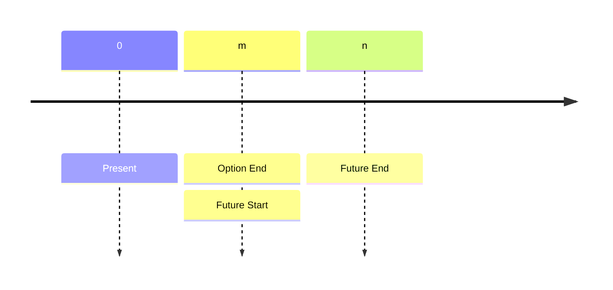
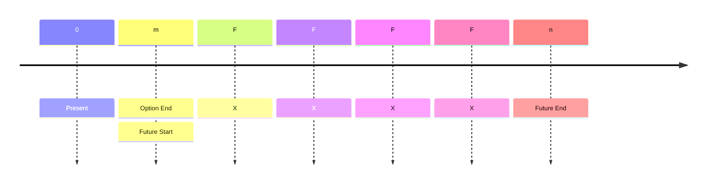

<style>
.blur-hover {
    filter: blur(5px);
    transition: filter 0.3s;
}
.blur-hover:hover {
    filter: none;
}
</style>

# Options

The fundamental logic is **No arbitrage** 

## Binomial Option Valuation

### Basic Formula

Given risk-neutral, the formula for Binomial at each step is:
$$
\begin{align}

   S_u &= S_0 \cdot u\\
   S_d &= S_0 \cdot d\\
   p_u &= \frac{e^{r\Delta t}}{u-d}\\
   p_d &= 1-p_u\\
   C_T &= \max(S_T-X,0)\\
   C_0 &= e^{-r\Delta t} (pC_u + (1-p)C_d)

\end{align}
$$

```python
class BinomialTreeOption:
    def __init__(self, df_spy, X, T, r, N, option_type="call"):
        """
        Initialize the Binomial Tree for option pricing with stage-specific volatility.
        """
        self.df_spy = df_spy
        self.S = spy_price
        self.X = X
        self.T = T
        self.r = r
        self.N = N
        self.option_type = option_type
        self.dt = T / N  # Time step size

    def compute_rolling_volatility(self, current_date, window=30):
        """
        Compute rolling volatility up to a given trading date.
        """
        spy_subset = self.df_spy.loc[:current_date]  
        log_returns = np.log(spy_subset["Close"] / spy_subset["Close"].shift(1))
        rolling_vol = log_returns.rolling(window=window).std() * np.sqrt(252)

        return rolling_vol.iloc[-1]  
    def build_stock_tree(self):
        """
        Build the binomial tree for stock prices with dynamic volatility.
        """
        stock_tree = np.zeros((self.N + 1, self.N + 1))
        stock_tree[0, 0] = self.S  

        trading_dates = self.df_spy.index[-self.N:]  

        for i in range(1, self.N + 1):
            current_date = trading_dates[i - 1]  
            sigma_t = self.compute_rolling_volatility(current_date)  
            u = np.exp(sigma_t * np.sqrt(self.dt))  
            d = np.exp(-sigma_t * np.sqrt(self.dt))  

            for j in range(i + 1):
                stock_tree[j, i] = stock_tree[0, 0] * (u ** (i - j)) * (d ** j)

        return stock_tree

    def build_option_tree(self):
        """
        Build the option price tree using backward induction.
        """
        stock_tree = self.build_stock_tree()
        option_tree = np.zeros((self.N + 1, self.N + 1))

        if self.option_type == "call":
            option_tree[:, self.N] = np.maximum(stock_tree[:, self.N] - self.X, 0)
        elif self.option_type == "put":
            option_tree[:, self.N] = np.maximum(self.X - stock_tree[:, self.N], 0)

        trading_dates = self.df_spy.index[-self.N:] 

        for i in range(self.N - 1, -1, -1):
            current_date = trading_dates[i]  
            sigma_t = self.compute_rolling_volatility(current_date) 
            u = np.exp(sigma_t * np.sqrt(self.dt))
            d = np.exp(-sigma_t * np.sqrt(self.dt))
            p = (np.exp(self.r * self.dt) - d) / (u - d)  

            for j in range(i + 1):
                option_tree[j, i] = np.exp(-self.r * self.dt) * (
                    p * option_tree[j, i + 1] + (1 - p) * option_tree[j + 1, i + 1]
                )

        return option_tree

    def price(self):
        """
        Compute the option price at time 0.
        """
        option_tree = self.build_option_tree()
        return option_tree[0, 0]

def compute_binomial_price(row, df_spy, r, N):
    X = row["strike"]
    expiration = row["expiration"]
    # set to global T
    T_local = T
    option = BinomialTreeOption(df_spy, X, T_local, r, N)
    return option.price()
```

### Components

Basic assumptions of binomial tree:

* Begin at $S_0$
* Up $U$ down $D$, default $D=\frac{1}{U}$. 

#### Model one

Proposed by Bruce Tuckman to describe fixed income pricing, as 
$$
dr = \sigma dw
$$


where $r$ is the interest rate, $w$ is a random walk stochastic process. When time is $1$, $r_u =r+\sigma$, $r_d = r-\sigma$. Therefore $S_u = Se^{\sigma}=SU$, $S_d=Se{-\sigma}=SD$. Therefore $D=\frac{1}{U}$ by default.

### Risk Neutrual Probability

Inferred from no arbitrage, the expected stock price is:
$$
E(S_t) = \pi_uS_0U+(1-\pi_u)S_9D
$$
which should be equal to risk free return: $S_0(1+r_f)^t$, then we will have:
$$
\begin{align}
\pi_u &= \frac{(1+r_f)^T-D}{U-D}\\
\pi_d &= 1-\pi_u = \frac{U-(1+r_f)^T}{U-D}
\end{align}
$$

### One Period Binomial Model

Now assuming European option:
$$
\begin{align}
C_{u,t}&= \max(0, S_u-X)\\
P_{u,t}&=\max(0, X-S-u)\\
C_{d,t}&=\max(0,S_d-X)\\
P_{d,t}&=\max(0,X-S_d)
\end{align}
$$
Then $C_0=PV(E(C))=\frac{(\pi_u C_{u,t}+\pi_d C_{d,t})}{(1+r_f)^t}$. $P_o = \frac{(\pi_u P_{u,t}+\pi_d P_{d,t})}{(1+r_f)^t}$.

### Put-Call Parity 


|              | **Fiduciary call**      | **Protective put** |
| ------------ | ----------------------- | ------------------ |
|              | $c + \frac{X}{1+r_f}^t$ | $S+p$              |
| **If S ≤ X** | $0+X=X$                 | $S+(X-S)=X$        |
| **If S ≥ X** | $(S-X)+X=S$             | $S+0=S$            |

Then we have:
$$
c+\frac{X}{(1+r_f)^t}=S_0+p
$$

### Risk-free Portfolio Method

1. Constructing risk-free portfolio by long $\delta$ stock and short a call, the value of the portfolio at time $0$ is:
   $$
   V_{0}=c-\delta S_0
   $$

2. Then at $t$:
   $$
   \begin{align}
   V_{u,t}&=\delta S_u-C_u\\
   V_{d,t}&=\delta S_d-C_d
   \end{align}
   $$

3. Since the portfolio is risk free, $V_{u,t}=V_{d,t}$, then we solve:
   $$
   \delta S_0 = \frac{C_u-C_d}{U-D}
   $$

4. Then we can solve $C_0$ by $V_{u,t}=V_{d,t}=(1+r_f)^t V_0$, where $V_0 = c-\delta S_0$:
   $$
   C_0 = \delta S_0+\delta S_u -C_u
   $$
   Then we can get the same formula as the risk neutrual probability method.


> [!Note]
>
> Arbitrage opportunity exists when value is not equal, $\delta$ is arbitrage ratio.


### Two Period Binomial Model

Same as one period model, $\pi_u$ and $\pi_d$ could be calculated with same method (actually same number!). Then simply calculate the present value of the stock expectation.

#### Example

Consider a non-dividend-paying stock currently priced at €50. A European-style call option written on this stock has two years until maturity and an exercise price of €50. The risk-free interest rate is assumed to be 5% per annum. Additionally, the up factor (U) is given as 1.356 and the down factor (D) is 0.744. Based on this information, we are tasked with calculating both the current value of the call option and the current value of the corresponding put option.

<span class="blur-hover">

To solve the problem, we begin with 

**Step 1**: calculating the stock prices in the binomial tree. The up-up price is $S^{++} = 91.94$, the up-down and down-up price is $S^{+-} = S^{-+} = 50.44$, and the down-down price is $S^{–} = 27.68$.

**Step 2**, we compute the option values at maturity. For the call option, we have $C^{++} = 41.95$, and both $C^{+-} = C^{-+} = 0.44$. The down-down call value is $C^{–} = 0$. For the put option, we get $P^{++} = P^{+-} = P^{-+} = 0$, and $P^{–} = 22.32$.

**Step 3** involves calculating the risk-neutral probability. The up probability is $\pi_U = \frac{(1 + 0.05) - 0.744}{1.356 - 0.744} = 0.5$, and the down probability is $\pi_D = 1 - \pi_U = 0.5$.

Next, we calculate intermediate option values. For the call, $C^{+} = \frac{(0.5 \times 41.94 + 0.5 \times 0.44)}{1.05} = 20.18$, and $C^{-} = \frac{(0.5 \times 0.44 + 0.5 \times 0)}{1.05} = 0.22$. For the put, $P^{+} = \frac{(0.5 \times 0 + 0.5 \times 0)}{1.05} = 0$, and $P^{-} = \frac{(0.5 \times 0 + 0.5 \times 22.32)}{1.05} = 10.63$.

**Step 4**, we calculate the initial values. The call option is worth $C_0 = \frac{(0.5 \times 20.18 + 0.5 \times 0.22)}{1.05} = 9.71$, and the put option is worth $P_0 = \frac{(0.5 \times 0 + 0.5 \times 10.63)}{1.05} = 5.06$.

As an additional tip, using the put-call parity formula, we can verify:

$P_0 = C_0 + PV(X) - S_0 = 9.71 + \frac{50}{(1.05)^2} - 50 = 5.06$.

</span>

### Advance Exercise of American Option

* American call options on non-dividend stock will not be exercised early because the value of call option will be greater than exercise: *Worth more alive than dead*.
* American call option on dividend-paying stock or deep in-the-money option could be exercised earlier. 

### Two Period Binomial Model of American Option

American option may be exercised early when:

* Exercise value is greater than arbitrage-free value
* Use the higher between exercise value and calculated price at each node.

> [!Note]
>
> Calculate the option value if exercised

### Interest Rate Option

The valuation process is same as standard binomial model, but times nominal principal.


## Black-Scholes Model

### Assumption

Black-Scholes model is the continuous format of Binomial (when $t\to\infty$).

* The underlying asset follows Geometric Brownian Motion, moves smoothly from price to price (continuous).

* The continuously compounding risk-free rate is constant and down. Assuming borrowing and lending at risk-free rate.
* The volatility of underlying asset is constant
* The market is frictionless:
  * No transaction costs, no taxes, no regulatory constraints
  * No arbitrage
  * The underlying asset is highly liguid, and continuous trading
  * Short selling of the underlying asset is permitted

### Basic Formula

The formula for Black-Scholes is:
$$
\begin{align}

​    C_0 &= S_0 N(d_1) - X e^{-r_f^cT} N(d_2) \\
P_0&= C_0+Xe^{-r_f^cT}-S_0\\
&=-S_0N(-d_1)+Xe^{-r_f^cT}N(-d_2)
\\

​    d_1 &= \frac{\ln(\frac{S_0}{X}) + (r_f^c + \frac{1}{2} \sigma^2)T}{\sigma\sqrt{T}} \\

​    d_2 &= d_1 - \sigma\sqrt{T}

\end{align}
$$

```python
def black_scholes(S, X, T, r, sigma):
    d1 = (np.log(S / X) + (r + 0.5 * sigma ** 2))/(sigma * np.sqrt(T))
    d2= d1 - sigma * np.sqrt(T)
    return S * norm.cdf(d1) - X * np.exp(-r * T) * norm.cdf(d2)
```

### Initial Model

Similar as put-call parity, **call option** can be regarded as leveraged stock investment (Long stock($N(d_1)$) and Short risk-free zero coupon bond($N_(d_2)$)). **Put option** can be regarded as Long risk-free asset($N(-d_2)$) and Short selling stock ($N(-d_1)$).

#### Conclusion of $N(d_1)$ and $N(d_2)$

* $N(d_1)$ is the $\delta$ of call option
* $-N(-d_1)$ is the $\delta$ of a put option
* $N(d_2)$ is the risk-neutral probability that a call option will be exercised at expiration (ITM).
* $N(-d_2)$ is the risk-neutral probablility that a put option will be exercised at expiration (ITM).
* $N_(-d_2)=1-N(d_2)$.

### BSM Model with Carrying Benefits or Costs

$$
\begin{align}
C_o &= S_0e^{-\gamma T}N(d_1)-Xe^{-r_f^cT}N(d_2) \\
P_o &= -S_0e^{-\gamma T}N(-d_1)+Xe^{-r_f^c T}N(-d_2) \\
d_1 &=\frac{\ln(\frac{S_0}{X})+(r_f^c-\gamma+\frac{\sigma^2}{2})}{\sigma\sqrt{T}}\\
d_2 &= d_1-\sigma\sqrt{T}
\end{align}
$$

### Options On Future



#### Position

The position of future depends on the position on option:

* Long call $\to$ Long futrue position
* Long put $\to$ Short future position

The strike price is contracted in the option. For long call, exercise if $F<F_m(n)$. For long put, exercise if $F> F_m(n)$.

#### Black Model

$$
\begin{align}
C_0 &= F_0(T)e^{-r_f^cT}N(d_1)-Xe^{-r_f^cT}N(d_2)\\
P_0 &= -F_0(T)e^{-r_f^cT}N(-d_1)+Xe^{-r_f^cT}N(-d_2)\\
d_1 &= \frac{\ln (\frac{F_0(T)}{X})+\frac{\sigma^2}{2}T}{\sigma\sqrt{T}}\\
d_2&=d_1-\sigma\sqrt{T}
\end{align}
$$

> [!Important]
>
> Usually in practice, option and future will be set expire at same tim e (American Option).

### Interest Rate Option

The contract is similar to Option on Futures and FRA. The position judgement and exercise case is exactly same as Option on Futures
$$
\begin{align}
C_0 &= NPe^{-r_f^c n \frac{30}{360}}(FR_{m\times n} N(d_1)-XN(d_2))\frac{(n-m)30}{360}\\
P_0 &= NP e^{-r_f^cn\frac{30}{360}}(XN(-d_2)-FR_{m\times n}N(-d_1))\frac{(n-m)30}{360}
\end{align}
$$
### Swapation

Swapation is an option to enter a swap:

1. A payer swapation is an option to enter into a swap as the fixed-rate payer (Long).
2. A receive swapation is an option to enter into a swap as the fixed rate receiver (Short).

$$
\begin{align}
C_0 &= NP(\text{Accural Period})\text{PVA of}(R_{fix}N(d_1)-R_XN(d_2))\\
P_0 &= NP(\text{Accural Period})\text{PVA of}(-R_{fix}N(-d_1)+R_XN(-d_2))
\end{align}
$$



## Greeks

From Black-Scholes model,
$$
C_0 = S_0 N(d_1) - X e^{-r_f^cT} N(d_2) 
$$
We can understanding it asL
$$
C_0 = f(S_0, X, r_f^c, T, \sigma)
$$
Then, $\delta$ is defined as: 
$$
\delta = \frac{\partial C_0}{\partial S_0}
$$
$\gamma$ is defined as:
$$
\gamma = \frac{\partial^2 C_0}{\partial S_0^2}=\frac{\partial \delta}{\partial S_0}
$$
$\theta$ is defined as:
$$
\theta = \frac{\partial C_0}{\partial t}
$$
$\upsilon$ is defined as: 
$$
\upsilon = \frac{\partial C_0}{\partial \sigma}
$$
$\rho$ is defined as:
$$
\rho = \frac{\partial C_0}{\partial r_f^ c}
$$

### Delta

For non-dividend paying stock: $\delta_{call}=N(d_1)$, $\delta_{put} = -N(-d_1)$.

> [!Note]
>
> In this case, $\delta_{call}=\delta_{put}+1$


For dividend-paying stock: $\Delta_{call}=e^{-\delta T}N(d_1), \Delta_{put}=-e^{-\delta T}N(-d_1)$, where $\delta$ here is denoting the dividend rate.

> [!Note]
>
> $\delta$ is between $(0,1)$ for call and $(-1, 0)$ for put. It changes more drastically when closer to exercise date.

### Gamma

> [!Note]
>
> $\gamma$ and $\delta$ are just convexity and duration in fixed income.

$\gamma$ reaches its max when at the money. $\gamma$ increase when exercise data get closer (at the money). For deep in the money and out of the money option, $\gamma$ decrease when exercise data get closer.

> [!Note]
>
> **$\gamma$ neutral strategy** can be built by combining positions of options, then further build $\delta$ neutral strategy by add position of underlying stock (since stock has no $\gamma$).

### Theta

Theta is usually negative for both call and put options as their value decrease in value by time. With:

* **Exception:** Deep in the money put options


